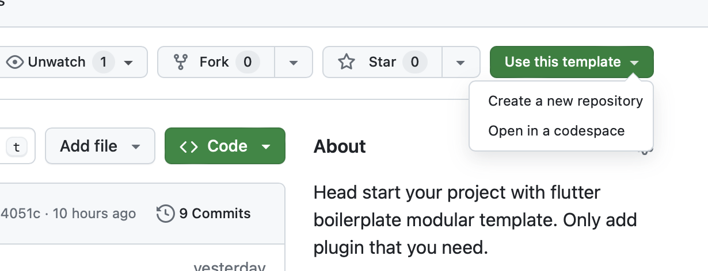
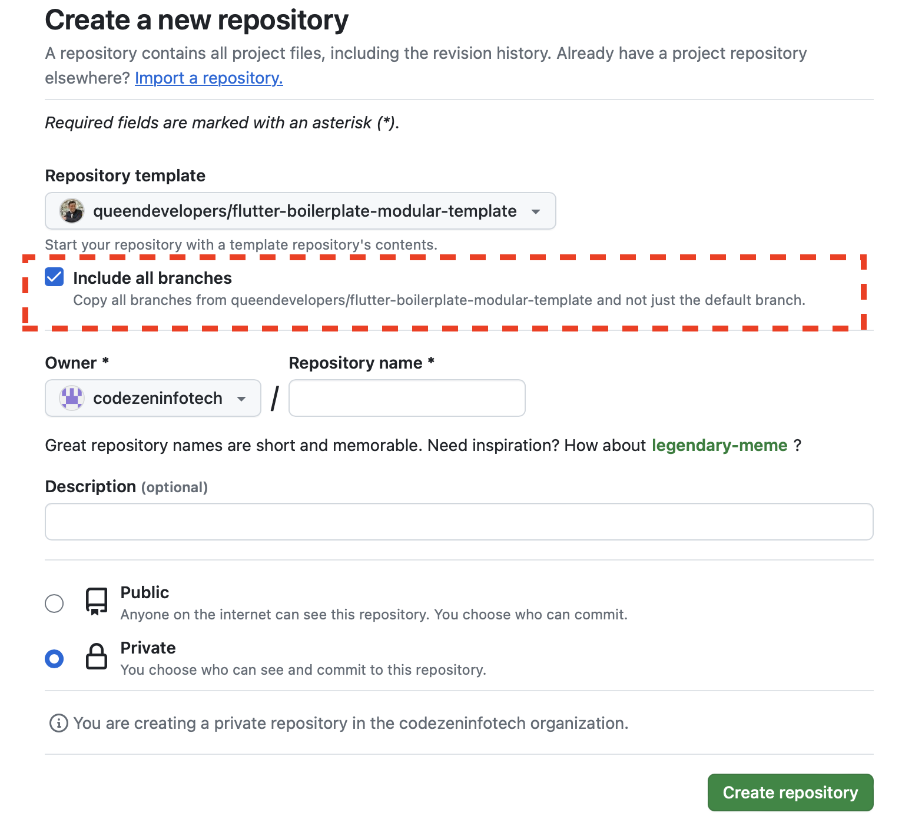

# flutter-boilerplate-modular-template
Head start your project with flutter boilerplate modular template. Only add modules that you need.

#Getting Started
Rename package name
Rename app name

app-icon

use as package name

